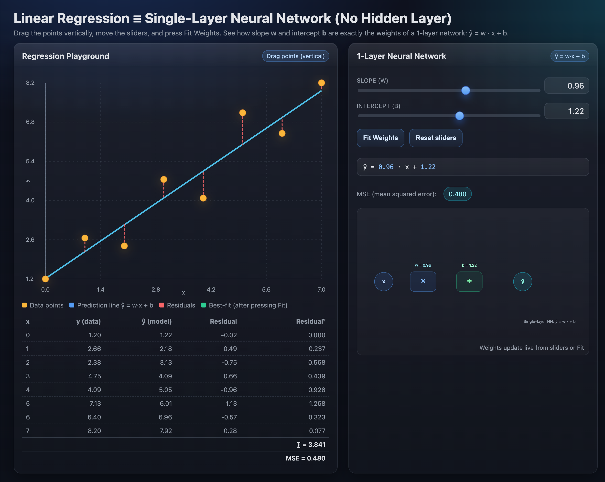
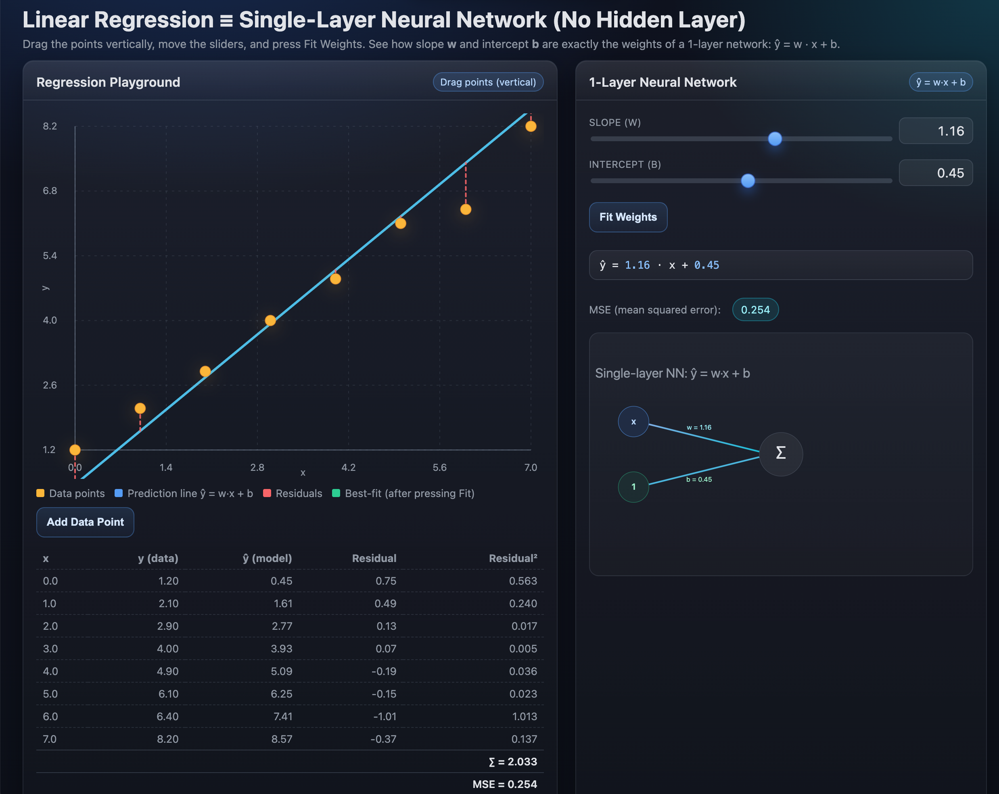

# Agent-Based Coding Workflow
**Work in progress**
---

## Motivation

Over the past **month** I’ve experimented with coding agents:
- Created small projects 
  - most were **demonstrations for statistical concepts** from scratch.
- Applied this workflow to create **JavaScript demos**
  - Aven though I basically don’t know JavaScript 😄.  
  - I can read it thanks to R, Python, and Java experience — but I can’t “speak”.
- **Disclaimer:** This is a document in progress — a reflection on my current working style, not a final “best way.”

---

## Introduction – Why This Matters

Without a clear split between **discussion** and **execution**, coding projects risk:
- Mixing unfinished ideas into code too early → inconsistent edits.
- Slower progress from constant back-and-forth changes.

⚠️ **Beware of lost context!**  
  Happens if you split roles without persistent context (use pinned files).

---

## Roles at a Glance

| 💬 **Assistant** | ⚙️ **Agent** |
|------------------|-------------|
| Broad discussion & brainstorming | Executes code changes |
| Clarifies goals & scope | Works from fixed requirements |
| Produces requirements doc | Edits/refactors codebase |

---

## Two Modes of Interaction

1. **Assistant → Agent**  
   - Start with 💬 Assistant to explore and scope.  
   - Create a clean requirements file.  
   - Hand over to ⚙️ Agent for implementation.

2. **Direct to Agent**  
   - Go straight to ⚙️ Agent when requirements are already clear.  
   - Best for quick, small, well-defined changes.

---

## Step 0 – Don’t Skip This

**Subject Scoping**  
- Define problem & goal  
- Decide features & constraints  
- Identify required inputs  
- Note edge cases

💡 **Note:** This step is done with an **assistant** (often external, e.g., ChatGPT), kept *outside* the project to freely explore ideas before defining the first `requirements.md`.

---

## Step 0 – Round 0 Prompt (External Assistant)

Talk to ChatGPT about the project and then: 
```
> I want to define the initial scope for a coding project. Please ask me clarifying questions until we have a clear:  
> - Problem statement  
> - Goals and success criteria  
> - Feature list  
> - Constraints and assumptions  
> - Required inputs and outputs  
> - Edge cases and possible pitfalls  
> Once you have enough information, summarize the requirements in a concise, well-structured Markdown document.  
> Don’t start coding — just focus on getting the requirements complete and unambiguous.
```

After this, create or paste the result into `requirements.md` in Cursor, pin it.

---
## Step 1 – Send to Agent ⚙️

- Provide only relevant code files + requirements  
- Keep discussion out of prompt  
- Let ⚙️ Agent edit per requirements

---

## Step 2 – Review & Iterate 💬->⚙️...

- Test changes in your dev environment  
- Note issues or missing features  

There are three ways to handle changes:
- Minor tweaks you can code yourself (e.g., adjust a title, change a constant) → just do them directly in your editor.
-  Minor tweaks via Agent (e.g., rename a variable, small refactor) → let the Agent apply them directly, no need to update requirements.
- Substantive changes (new features, altered logic, UI changes) → first update the requirements file as the single source of truth. These can then be implemented either directly by you or via the Assistant.

---

## Step 3 – Polishing

- Improve UI, names, style, docs  
- Avoid new features here — stay on scope  
- Can involve **multiple agents** ⚙️,⚙️,⚙️
  - e.g., one for refactoring, one for docs
  - You might want to create github issues for that  
- For very minor edits (e.g., changing a title), I sometimes code directly myself.

---

## Choosing the Right Mode

💬 **Assistant → Agent**  
Use when:
- Requirements are unclear
- You need brainstorming & scope alignment

⚙️ **Direct to Agent**  
Use when:
- Requirements are already written
- Task is small, quick, well-defined

---

## Working with Multiple Agents
I did not try this yet but I think it's a good idea.

- Try to let them work on different parts of the codebase (UI vs Test)
- Add instrructions to requirements file or use github issues for that.
- Example:
```
## Round 4 – Scope Update
- Added chart zoom feature  
...
### Issue I-001 – Rename controls for clarity
- Change “Learning Rate” → “LR”  
- Update tooltip text accordingly  
Acceptance: All references updated, no layout change

### Issue I-002 – Extract plotting utils
- Move helpers to src/utils/plot.ts  
- Update imports, ensure tests pass
```

Promt:
```
Work on Issue I-011 from requirements.md.  
Follow all general rules in requirements.md and AGENT_RULES.md.  
Do not make changes outside the scope of this issue.  
Update only the necessary files to complete this task.  
```


## General Tips

### Reuse Past Work
- Reference similar projects for consistency  

# Example

## Linear Regression Demo
After the second epoch:


## The Requirement (in Round 3)

Nearly all requirements are met, but there are still some issues to address.

1. The network is still noy working properly (see the screenshot, and hand drawn sketch how it should look like. (I dragged both files into cursor's agent window)
2. Remove Reset slider button (not needed).
3. Add a button on the left side to create new data points.


<small>Actually I did not use the assistant but wrote it directly to the requirements file.</small>

---

## The Result
After the third epoch:


---
## Usage for that workflow outside Software Development

**Planning-heavy work** → *Best for Assistant → Agent*  
- *Example: Academic writing*  
  - Needs a frozen structure before drafting.  
  - Ensures consistent tone, formatting, and flow.

**Exploration-heavy work** → *Best for direct Agent use*  
- *Example: Investigative data analysis*  
  - Plan evolves continuously through interactive plotting and testing.  
  - Requirements emerge dynamically.

## Further Reading

[Cursor_Tips.md](Cursor_Tips.md)